# Off-World — gallery

Every image here is generated: drawn as SVG by the scripts in [`src/`](src),
rendered with `rsvg-convert`, then given a bloom and grain pass. Nothing is
taken from any film.

Thumbnails are 1000px. Click one for the full 3840x2400 original.

Each scene ships as a **dry** and a **wet** plate. The wet plates below carry the
wet ground, reflections and heavy haze — but no painted raindrops, because when
one is on screen the live particle layer supplies the falling kind. That is why
they look still here.

If you would rather not spend the CPU on falling rain, `./rain-mode.sh static`
swaps in a second set with the drops rendered into the image. Same scenes, rain
that holds still. See [rain, falling or painted](README.md#rain-falling-or-painted).

---

## Dawn — Tyrell Approach

A wireframe ziggurat over a light grid, the hour before the city wakes.

| Dry | Wet |
|:---:|:---:|
| [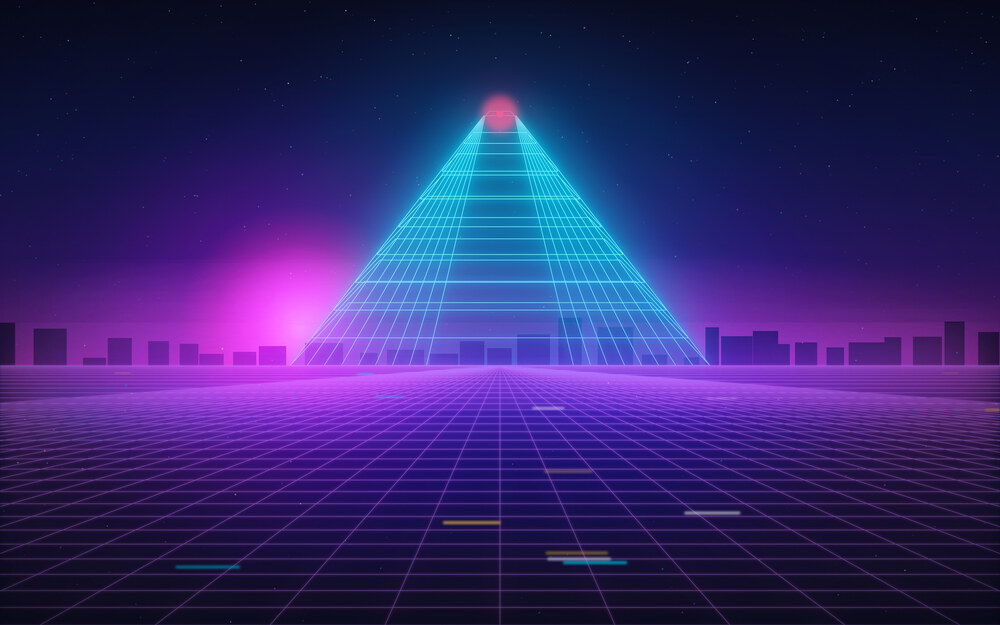](backgrounds/5-tyrell-approach-clear.jpg) | [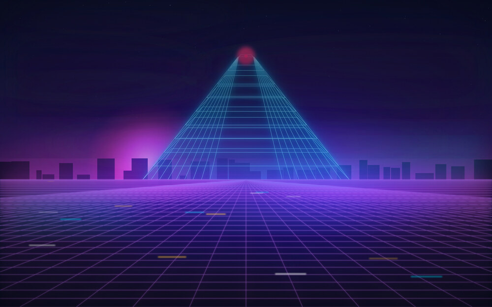](backgrounds/5-tyrell-approach-rain.jpg) |

## Day — Off-World Colonies

The sun over the dust, a ziggurat on the right, and a single figure for scale.

| Dry | Wet |
|:---:|:---:|
| [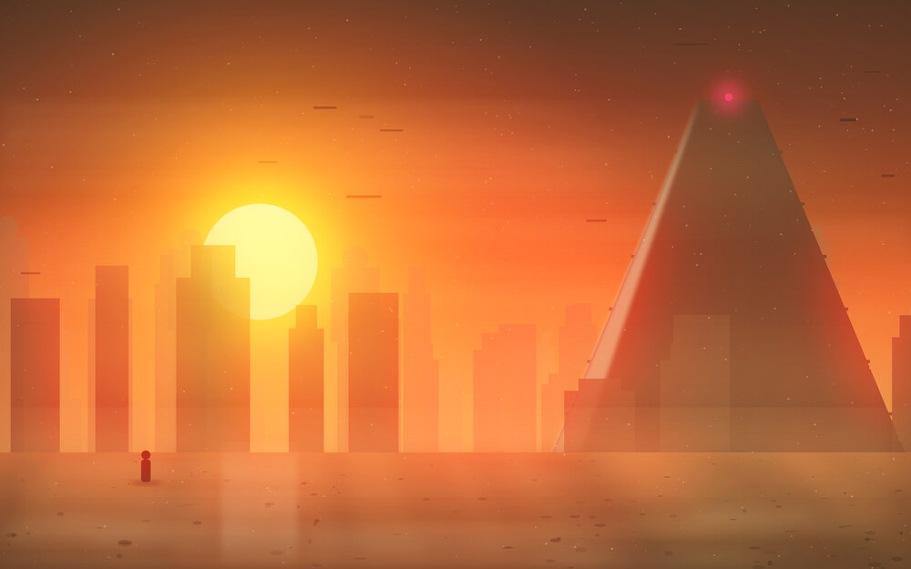](backgrounds/2-off-world-colonies-clear.jpg) | [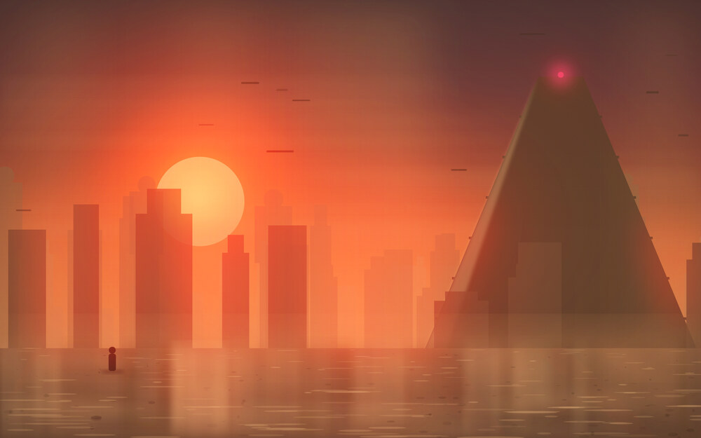](backgrounds/2-off-world-colonies-rain.jpg) |

## Dusk — Unicorn

Gaff's origami unicorn, folded from light and rearing over the skyline —
the Director's Cut, projected.

| Dry | Wet |
|:---:|:---:|
| [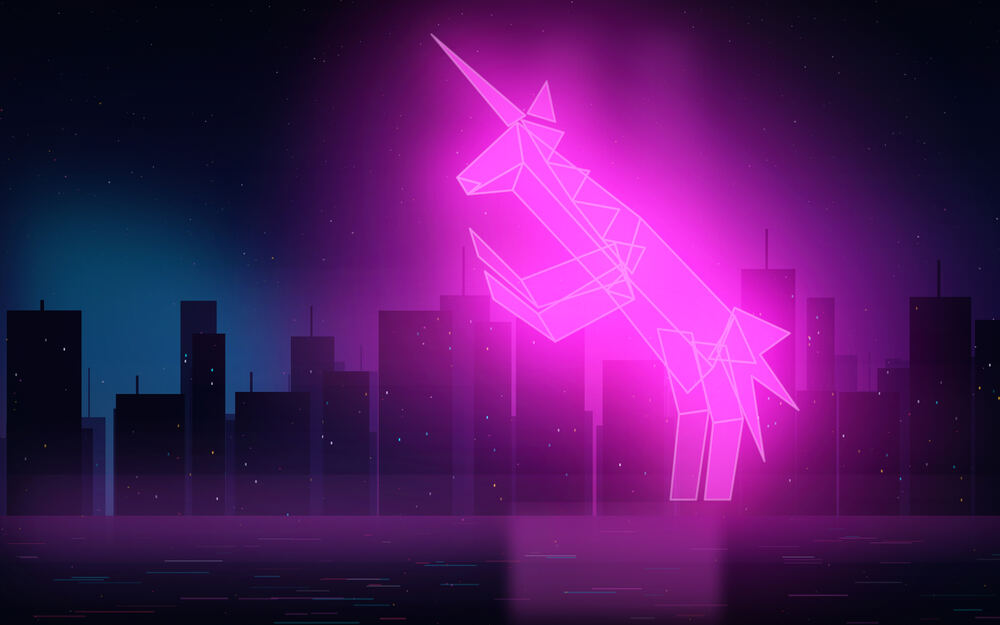](backgrounds/6-hologram-clear.jpg) | [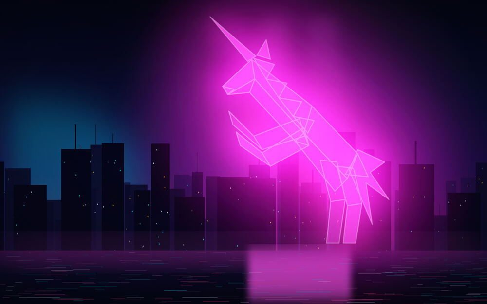](backgrounds/6-hologram-rain.jpg) |

## Night

Three scenes, rotating every couple of hours so it is not the same view all night.

### Spinner Descent

A rain-drowned megacity under a colossal advertising screen.

| Dry | Wet |
|:---:|:---:|
| [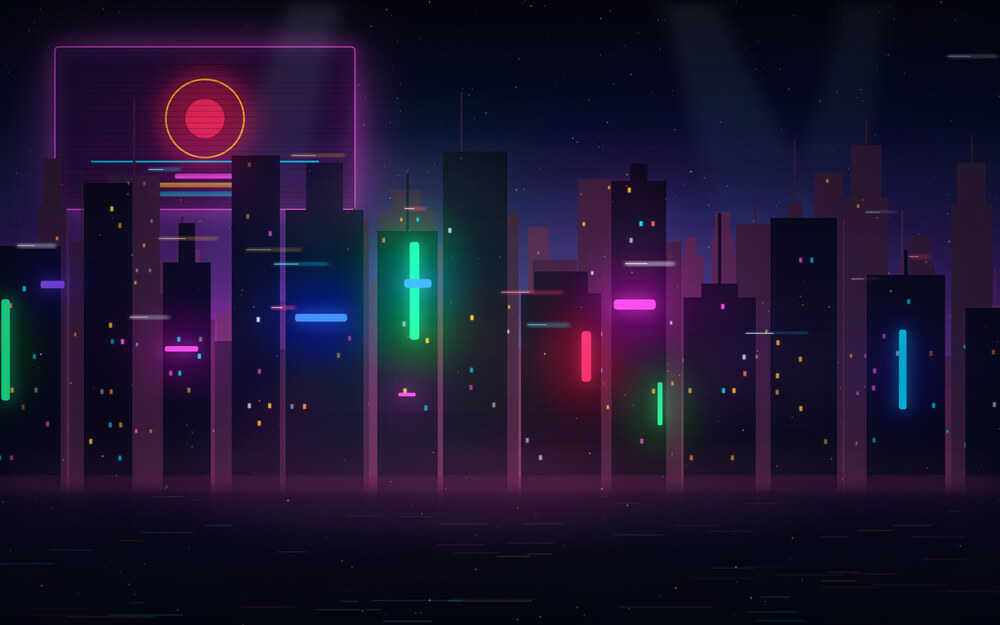](backgrounds/1-spinner-descent-clear.jpg) | [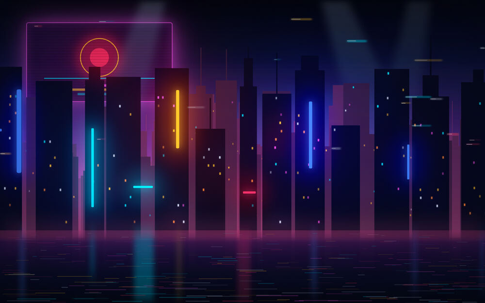](backgrounds/1-spinner-descent-rain.jpg) |

### Neon Signage

An alley of light seen through wet glass, three depth planes deep.

| Dry | Wet |
|:---:|:---:|
| [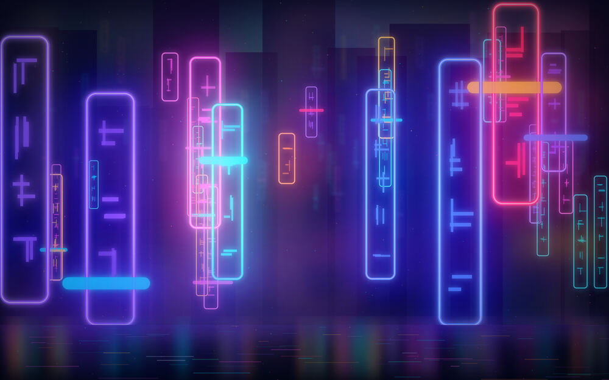](backgrounds/4-neon-signage-clear.jpg) | [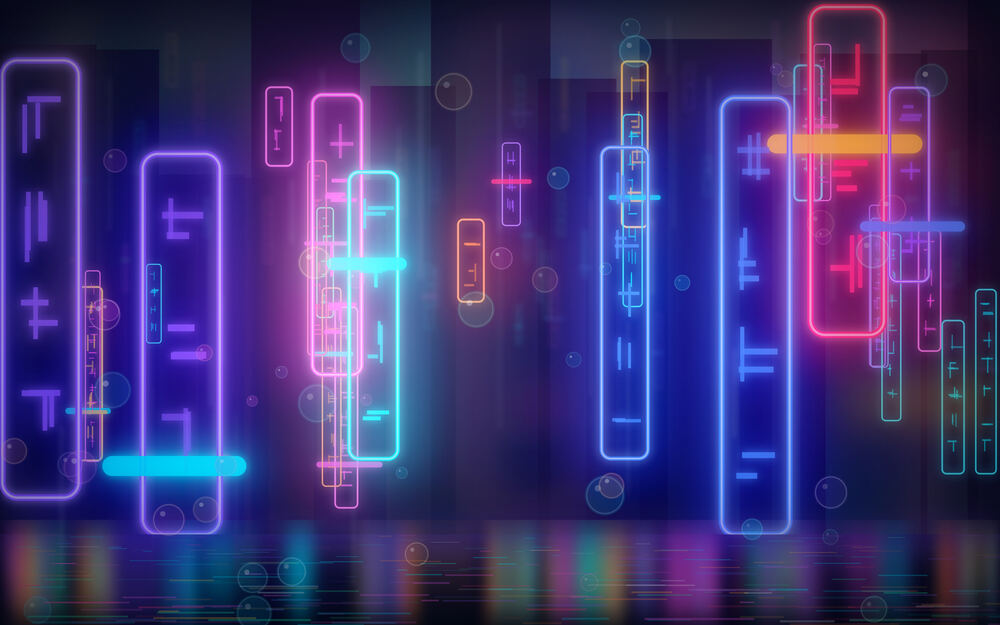](backgrounds/4-neon-signage-rain.jpg) |

### Voight-Kampff

The empathy test, seen from inside the machine. Eleven hundred iris fibres.

| Dry | Wet |
|:---:|:---:|
| [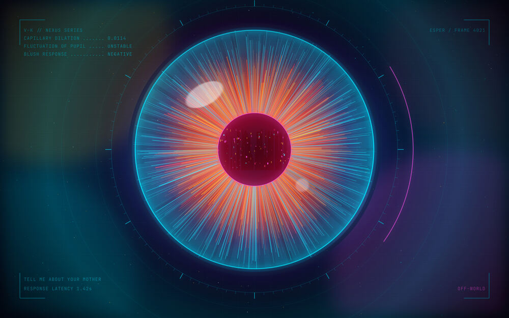](backgrounds/3-voight-kampff-clear.jpg) |  |

---

## Palette

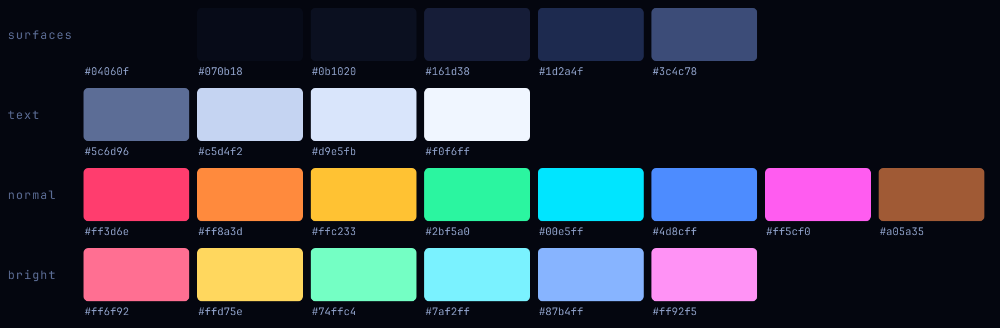

Cyan is the accent, magenta the counterweight, amber the warm note. Window
borders run a magenta-to-cyan gradient, and the Omarchy shell reuses it for
popups, notifications, the launcher and the lock screen. The full definition is
[`colors.toml`](colors.toml).

## Icons

Twenty-three neon-noir folders with a magenta-to-cyan edge and colour-coded
glyphs, inheriting `Yaru-magenta-dark` so anything not overridden still
resolves. Drawn by [`src/gen_icons.py`](src/gen_icons.py).

## The desktop

---

Back to the [README](README.md) for install and configuration.
