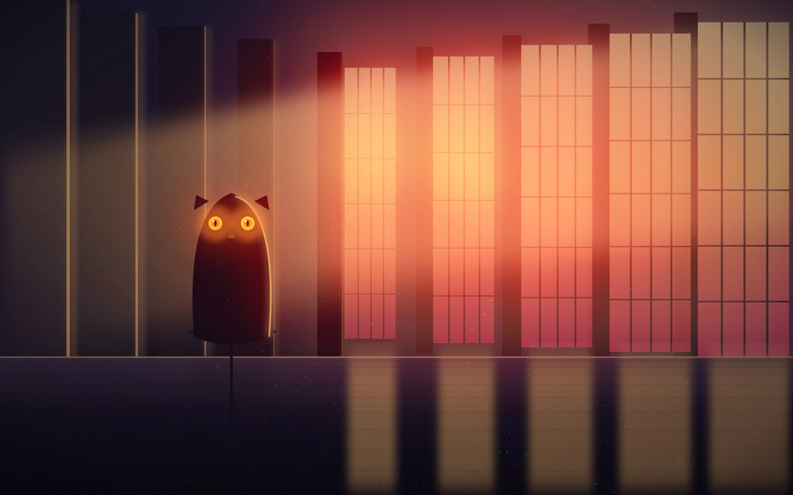
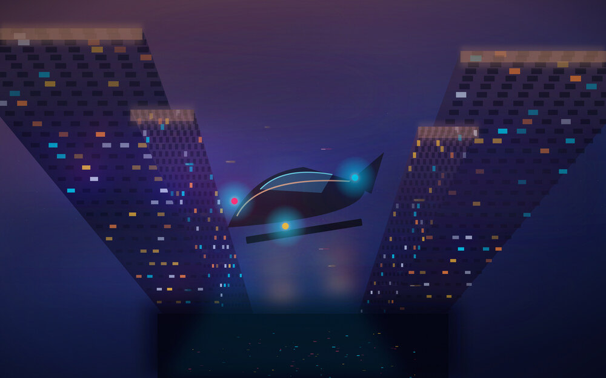
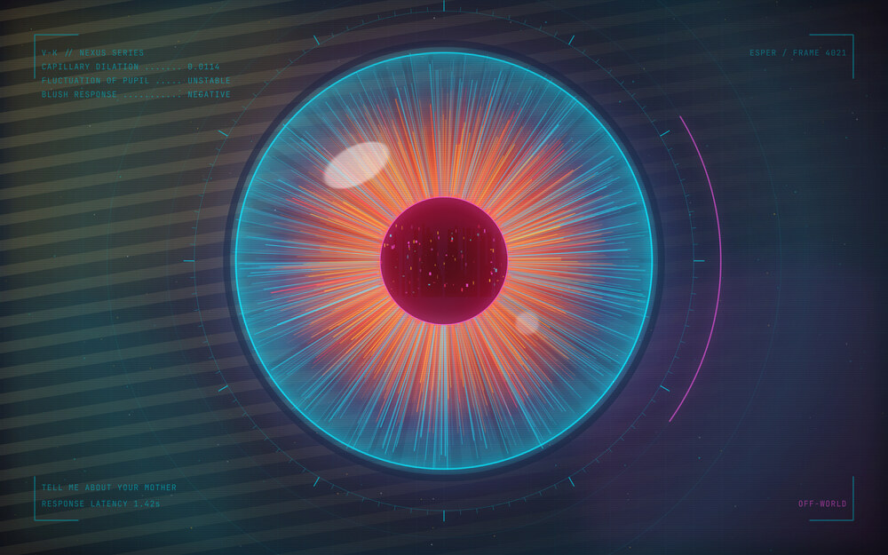
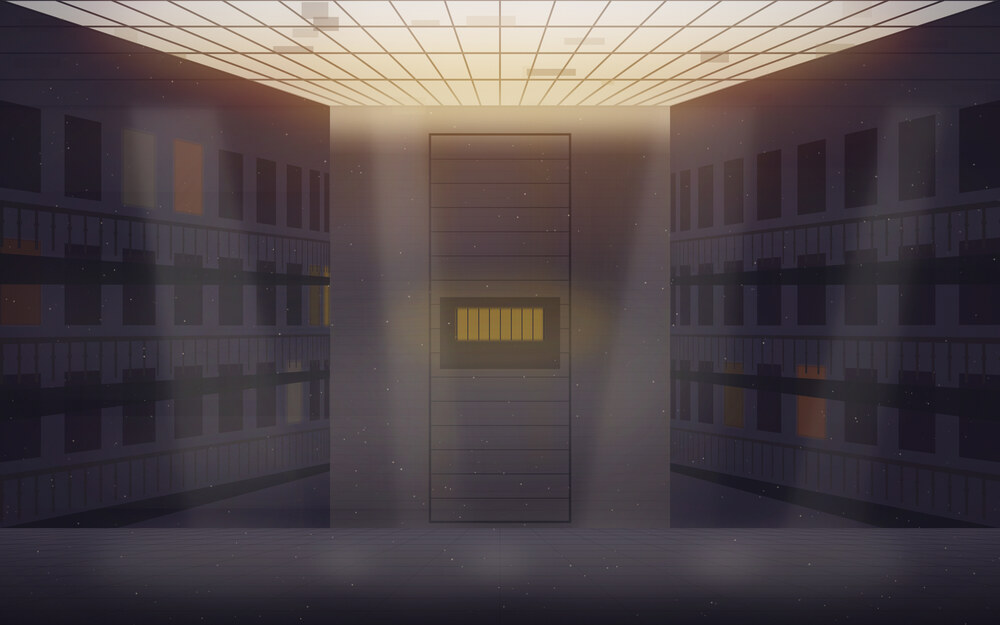
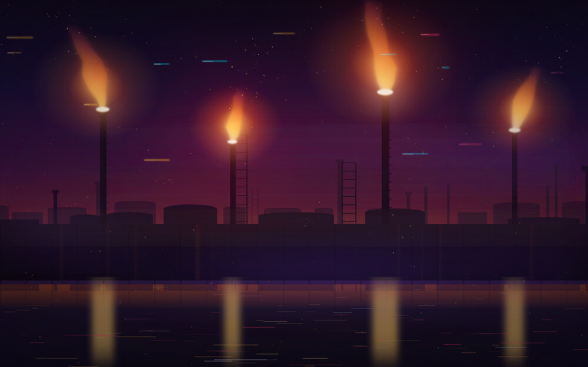
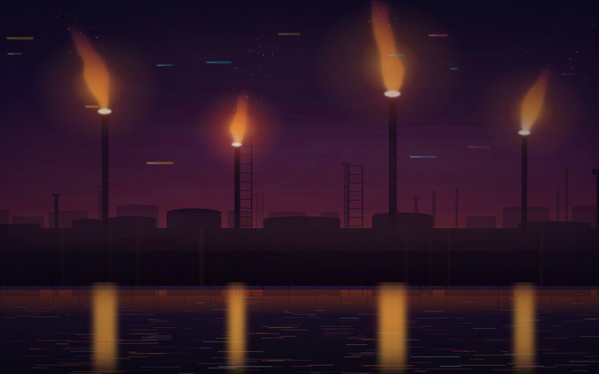
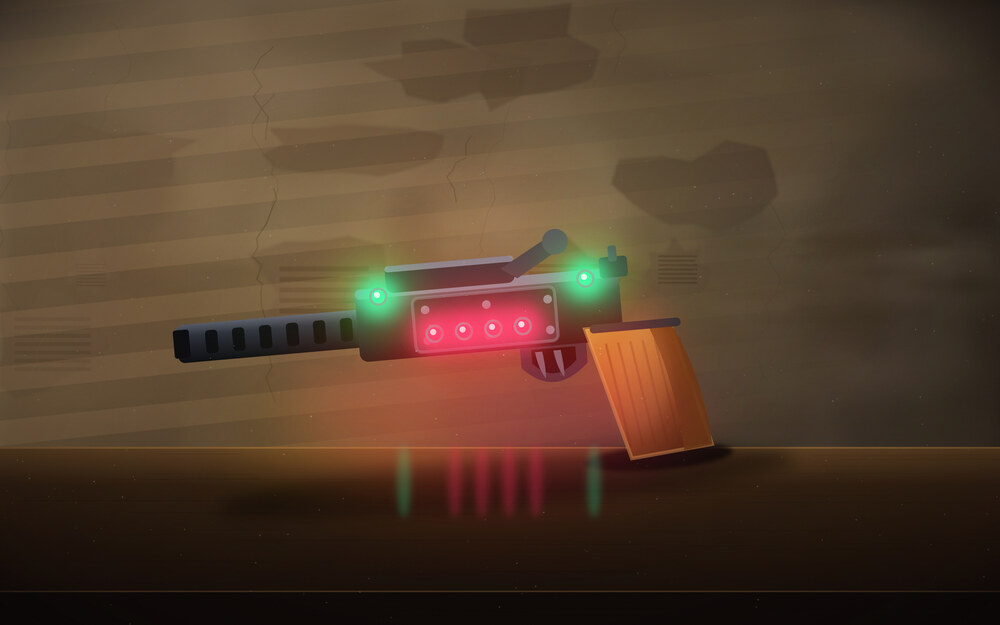
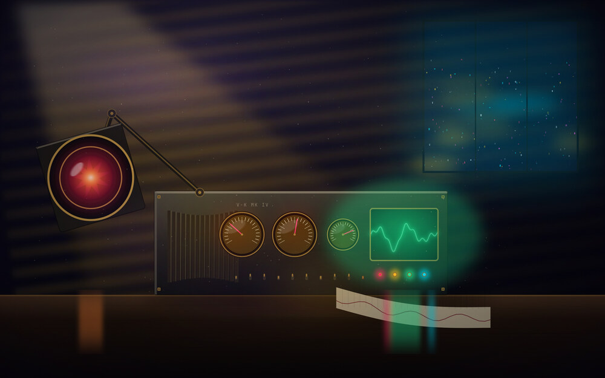

# Off-World - gallery

Every image here is generated: drawn as SVG by the scripts in [`src/`](src),
rendered with `rsvg-convert`, then given a bloom and grain pass. Nothing is
taken from any film.

Thumbnails are 1000px. Click one for the full 3840x2400 original.

Twelve scenes, three for each phase of the day. Each scene is authored and
rendered for its own phase, so the day scenes are genuinely lit and the night
scenes keep their blacks.

The seven outdoor scenes ship as a **dry** and a **wet** plate. The wet plates
below carry the wet ground, reflections and heavy haze - but no painted
raindrops, because when one is on screen the live particle layer supplies the
falling kind. That is why they look still here.

The five interiors have a single plate. Rain you could only see through a
window is not worth a second 2 MB image, and the falling-rain layer keys off the
`-rain` suffix, so an interior never drizzles indoors.

If you would rather not spend the CPU on falling rain, `./rain-mode.sh static`
swaps in a second set with the drops rendered into the image. Same scenes, rain
that holds still. See [rain, falling or painted](README.md#rain-falling-or-painted).

---

## Dawn - Tyrell Approach

A wireframe ziggurat over a light grid at first light.

| Dry | Wet |
|:---:|:---:|
|  |  |

## Dawn - Tyrell's Office

The hall at first light, and the owl that watches it.

| Interior - one plate |
|:---:|
|  |

## Dawn - Spinner Ascent

A police spinner climbing into first light.

| Dry | Wet |
|:---:|:---:|
|  |  |

## Day - Off-World Colonies

A colossal sun over the dust, monoliths, a ziggurat.

| Dry | Wet |
|:---:|:---:|
|  |  |

## Day - Voight-Kampff

The empathy test, seen from inside the machine.

| Interior - one plate |
|:---:|
|  |

## Day - Bradbury Atrium

Iron stairs under a rotting glass roof, at noon.

| Interior - one plate |
|:---:|
|  |

## Dusk - Unicorn

Gaff's folded unicorn, projected over the city.

| Dry | Wet |
|:---:|:---:|
|  |  |

## Dusk - Sea Wall Flares

The refinery plain at last light.

| Dry | Wet |
|:---:|:---:|
|  |  |

## Dusk - The Blaster

The gun on the table, against a wall that is giving up.

| Interior - one plate |
|:---:|
|  |

## Night - Spinner Descent

Rain-drowned megacity under an advertising sky.

| Dry | Wet |
|:---:|:---:|
|  |  |

## Night - Neon Signage

An alley of light seen through wet glass.

| Dry | Wet |
|:---:|:---:|
|  |  |

## Night - The Machine

The Voight-Kampff apparatus itself, on the desk, after dark.

| Interior - one plate |
|:---:|
|  |

---

## Palette

Cyan is the accent, magenta the counterweight, amber the warm note. Window
borders run a magenta-to-cyan gradient, and the Omarchy shell reuses it for
popups, notifications, the launcher and the lock screen. The full definition is
[`colors.toml`](colors.toml).

## Icons

Twenty-three neon-noir folders with a magenta-to-cyan edge and colour-coded
glyphs, inheriting `Yaru-magenta-dark` so anything not overridden still
resolves. Drawn by [`src/gen_icons.py`](src/gen_icons.py).

## The desktop

---

Back to the [README](README.md) for install and configuration.
