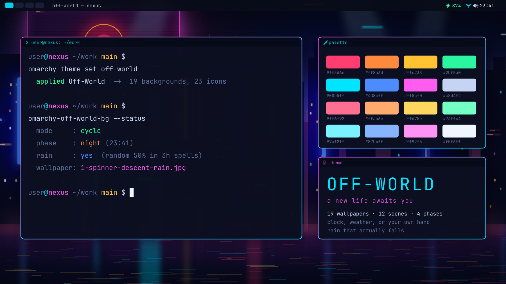

# Off-World

A neon-noir theme for [Omarchy](https://omarchy.org/), with wallpapers that
follow the time of day, the real weather, or nothing but your own hand — and
rain that actually falls.



**[See the full gallery →](GALLERY.md)** — all nineteen wallpapers, the palette,
and the icon set.

Every image is generated. The wallpapers are drawn as SVG by the scripts in
`src/`, rendered with `rsvg-convert`, then given a bloom and grain pass. Nothing
is taken from any film.

## Install

```bash
omarchy theme install https://github.com/brightwalker25/omarchy-off-world-theme
cd ~/.config/omarchy/themes/off-world && ./install.sh
```

The first command installs and applies the palette and wallpapers. The second
adds the parts that live outside a theme directory: the icon set, the wallpaper
switcher, its timer, and the rain. It does not touch your key bindings — it
prints the four commands worth binding and leaves
[`~/.config/hypr/bindings.lua`](#changing-it-yourself) to you.

Rain comes two ways — pick one at install time, or switch later:

```bash
./install.sh                 # falling rain: a live particle layer  (default)
./install.sh --static-rain   # painted rain: baked into the wallpaper, no CPU cost
./install.sh --no-rain       # no rain at all
```

## What's in it

**Palette.** Rain-dark blue surfaces, electric cyan, hologram magenta, Vegas
amber. Window borders run a magenta-to-cyan gradient, which the Omarchy shell
reuses for popups, notifications, the launcher and the lock screen. Alacritty,
foot, kitty, ghostty, btop, neovim, VSCode and Chromium all follow.

**Nineteen wallpapers**: twelve scenes, three for each phase of the day,
rendered at 3840x2400. Seven are outdoors and have a wet plate and a dry one;
five are interiors and have a single plate, because rain you can only see
through a window is not worth a second image. They are all in the
[gallery](GALLERY.md):

| Phase | Scene | |
|---|---|---|
| Dawn | Tyrell Approach | a wireframe ziggurat over a light grid |
| Dawn | Tyrell's Office | the hall at first light, and the owl that watches it |
| Dawn | Spinner Ascent | a police spinner climbing between towers into the sun |
| Day | Off-World Colonies | the sun over the dust, a ziggurat, a figure for scale |
| Day | Voight-Kampff | the empathy test seen from inside the machine |
| Day | Bradbury Atrium | iron stairs under a rotting glass roof, at noon |
| Dusk | Unicorn | Gaff's folded unicorn, rearing over the city |
| Dusk | Sea Wall Flares | the refinery plain burning off at last light |
| Dusk | The Blaster | the gun on the table, against a wall that is giving up |
| Night | Spinner Descent | rain-drowned megacity under a colossal advertising screen |
| Night | Neon Signage | an alley of light through wet glass |
| Night | The Machine | the Voight-Kampff apparatus itself, after dark |

Every scene is authored and rendered for one phase. Day scenes are lit and hazy
rather than bright; dusk and night keep their blacks. That is done in the
generators, in `src/palette.py`, so a day scene is genuinely daylit rather than
a night scene turned up.

**Twenty-three icons.** A GTK icon theme of neon-noir folders with a
magenta-to-cyan edge and colour-coded glyphs, inheriting `Yaru-magenta-dark` so
everything it does not override still resolves.

## Three modes

```bash
omarchy-off-world-bg --mode cycle      # the default
omarchy-off-world-bg --mode weather
omarchy-off-world-bg --mode manual
```

**cycle.** The clock picks the phase — dawn, day, dusk or night — and the phase
rotates through its three scenes every couple of hours. Rain is a weighted coin
held steady for three hours at a stretch, so the weather has a mood instead of
flickering every time the timer runs. Makes no network requests at all.

**weather.** The real conditions where you are pick the scene as well as the
plate: a thunderstorm gets Spinner Descent, drizzle gets Neon Signage, overcast
gets the Bradbury Atrium, clear gets Off-World Colonies. Each condition names
three candidates and the clock only breaks the tie, so a clear night still gets
a night scene rather than the desert at noon. This is the only mode that touches
the network.

**manual.** Nothing moves unless you move it.

Sunrise and sunset are computed locally from your coordinates, so cycle mode
needs no network call. Verified against Open-Meteo: within two minutes.

## Changing it yourself

| Key | |
|---|---|
| `SUPER + CTRL + ALT + SPACE` | next scene in this phase |
| `SUPER + CTRL + ALT + SHIFT + SPACE` | previous scene |
| `SUPER + CTRL + ALT + N` | flip the wet and dry plate |
| `SUPER + CTRL + ALT + A` | back to automatic, now |

Nothing is bound for you. Put this in `~/.config/hypr/bindings.lua`:

```lua
o.bind("SUPER + CTRL + ALT + SPACE", "Next Off-World wallpaper",
  "omarchy-off-world-bg --next")
o.bind("SUPER + CTRL + ALT + SHIFT + SPACE", "Previous Off-World wallpaper",
  "omarchy-off-world-bg --prev")
o.bind("SUPER + CTRL + ALT + N", "Off-World: toggle rain",
  "omarchy-off-world-bg --toggle-rain")
o.bind("SUPER + CTRL + ALT + A", "Off-World: back to automatic",
  "omarchy-off-world-bg --auto")
```

If a binding does nothing, give the command its absolute path
(`$HOME/.local/bin/omarchy-off-world-bg`): Hyprland does not necessarily have
`~/.local/bin` on `PATH`.

A pick you make by hand is **held until the light changes** — dawn to day, day
to dusk — and then the automatic modes take over again. That is long enough to
be worth pressing and short enough that it heals on its own without you having
to remember you pressed anything.

This applies however you make the pick. Omarchy's own background switcher
(`SUPER + CTRL + SPACE`) and `omarchy theme bg next` are noticed and held the
same way; before, the timer reverted them within fifteen minutes and they looked
broken. In manual mode the keys step through all twelve scenes rather than just
the current phase.

```
omarchy-off-world-bg --status          # mode, phase, rotation, hold, and why
omarchy-off-world-bg --list            # every wallpaper, grouped by phase
omarchy-off-world-bg --next            # what the key binding runs
omarchy-off-world-bg --toggle-rain     # outdoor scenes only
omarchy-off-world-bg --auto            # drop the hold
omarchy-off-world-bg --rain            # force the wet plate, now
omarchy-off-world-bg --clear           # force the dry one
omarchy-off-world-bg --at 06:30        # pretend it is dawn
omarchy-off-world-bg --scene 7         # jump to a scene, 1-12
omarchy-off-world-bg --dry-run --at 23:00 --rain
```

A systemd user timer re-checks every fifteen minutes.

### Configuration

`~/.config/omarchy/off-world.conf`:

```
MODE=cycle         # cycle | weather | manual
RAIN=random        # random | live | always | never  (cycle mode)
RAIN_CHANCE=0.5    # chance per spell, random only
RAIN_SPELL_HOURS=3 # how long one spell of weather lasts
LAT=               # blank derives from your timezone, offline
LON=
```

`RAIN=live` swaps the coin for real precipitation where you are, via Open-Meteo
(no account, no key), without letting the weather choose the scene as well.
Location comes from your system timezone via `/usr/share/zoneinfo/zone.tab` —
the nearest listed city, resolved on your machine, never IP geolocation.

## Rain, falling or painted

Each outdoor scene has a dry plate and a wet one — wet ground, reflections,
heavy haze. Interiors have neither: they get one plate and the falling-rain
layer leaves them alone. What puts rain *in the air* is up to you.

| | Falling | Painted |
|---|---|---|
| How | a particle layer over still wet plates | drops rendered into the image |
| Moves | yes | no |
| CPU while raining | ~13% of one core | none |
| Needs the shell plugin | yes | no |

Switch whenever you like — this swaps the plates and adds or removes the plugin:

```bash
./rain-mode.sh animated   # rain that falls
./rain-mode.sh static     # rain that does not
./rain-mode.sh status     # which is active
```

Both sets ship in [`plates/`](plates), so switching never re-renders anything.

### The falling kind

When a wet plate is on screen, a particle layer drizzles over it. Those plates
deliberately carry no painted drops, so the only rain you see is the moving
kind — which is why they look still on their own.

It is a small addition to Omarchy's own background plugin. Because that plugin
ships read-only, `plugin/install-rain.py` clones it into your config with
`omarchy plugin clone` and injects the layer into the clone. Re-running is safe.

```bash
python3 plugin/install-rain.py            # install or refresh
python3 plugin/install-rain.py --reclone  # after an Omarchy update
python3 plugin/install-rain.py --remove   # take it back out
omarchy restart shell
```

**Cost.** Measured on a 2880x1800 display: about 13% of one CPU core while it is
raining, and exactly zero when it is dry, because the particle system is stopped
rather than hidden. No measurable memory, and no growth over time. On a laptop
that is a real battery consideration — turn `density` down, or run
`./rain-mode.sh static` and get the hours back with rain that simply does not
move.

Tuning lives at the top of the rain block in your cloned
`~/.config/omarchy/plugins/*.background/Background.qml`:

```qml
property real density: 1.0    // how much falls
property real speed: 1.0      // how fast
```

Both hot-reload on save. `density: 0.5` roughly halves the CPU cost.

## Turning things off

```bash
systemctl --user disable --now off-world-wallpaper.timer   # stop the rotation
./rain-mode.sh static                                      # stop the animation
omarchy theme set tokyo-night                              # leave the theme
```

The theme keeps working with the timer off; backgrounds then cycle manually with
`omarchy theme bg next` like any other theme. `--mode manual` gets you the same
thing while leaving the timer in place to notice theme changes.

## Rebuilding the art

```bash
cd src
python3 build.py                  # all nineteen, ~13 min
python3 build_rain_plates.py      # wet plates, no painted drops (animated mode)
python3 build_static_rain.py      # wet plates with painted drops (static mode)
python3 gen_icons.py              # the icon theme
python3 gen_gallery.py            # docs/thumbs and GALLERY.md
```

`src/scenes.py` is the register: which module is which scene, which phase it
belongs to, and whether it is outdoors. Adding a scene means writing a
`sceneN.py` with `NAME`, `LIGHT`, `OUTDOOR` and `build(rain, light)`, then
listing it there — and in the matching table at the top of
`bin/omarchy-off-world-bg`, which the picker reads without importing `src/` so
that it keeps working with the repo deleted.

Those two tables are the one thing here that can silently drift, so there is a
test for it:

```bash
python3 src/test_picker.py
```

It checks the picker's table against the register, that every phase has three
scenes and at least one of them outdoors, that the rotation visits all three,
and that every weather code counted as wet lands on a condition that can
actually offer a wet plate.

Builds are byte-reproducible: the scene seeds are fixed, `rsvg-convert` is
deterministic, and `post.sh` seeds its film grain from the output filename. So
rebuilding an unchanged scene produces the identical file and `git status` stays
clean. That matters more than it sounds — these are 2 MB JPEGs, git cannot delta
them, and before the grain was seeded every rebuild wrote a whole new set of
blobs into history that could never be pruned.

Change the `random.Random(...)` seed at the top of a `sceneN.py` for a different
layout of the same design. `build.py` writes straight into the installed theme.

### What the images cost

`plates/animated-rain` is free: its files are byte-identical to the `-rain`
wallpapers in `backgrounds/`, so git stores one blob and both paths point at it.
`plates/static-rain` is the only duplicated set, about 16 MB, and it buys
`./rain-mode.sh static` switching modes instantly instead of re-rendering for
five minutes. Everything else in the repo is one copy of one image.

## See also

- [GALLERY.md](GALLERY.md) — every wallpaper, the palette, the icons

## License

MIT. Omarchy is MIT too; `plugin/install-rain.py` modifies a copy of its
background plugin in your own config and never touches the packaged original.
